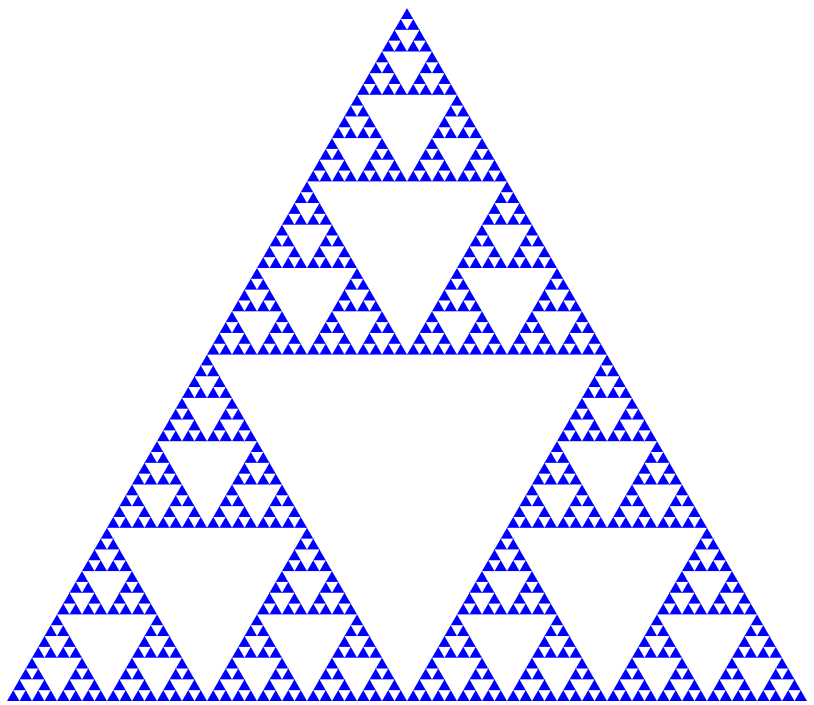

# FONIS hakaton 2022

### Zahtev:
Potrebno je napraviti algoritam koji iscrtava trougao Sjerpinskog. Trougao Sjerpinskog je fraktalna figura u obliku jednakostraničnog 
trougla rekurzivno podeljena u manje trouglove uklanjanjem središnjeg dela (trougla) originalnog trougla.

U ovom rešenju nije korišćena nikakva eksterna biblioteka za geometriju i/ili fiziku.

##Rešenje
Rešenje je implementirano na jednostavan način koristeći HTML canvas, i dve JavaScript funkcija za iscrtavanje trouglova.

###Algoritam

Skripta koja sadrži algoritam se sastoji od pomoćne funkcije `createTriangle(position, edge)` koja iscrtava obojeni trougao
na osnovu prosleđene pozicije trougla (**position**) i dužine njegove stranice(**edge**). Pozicija zadata kao parametar je *donje levo teme trougla*.

Glavni algoritam je sadržan u funkciji `createSierpinskiTriangle(position, edge, depth)` kojoj se prosleđuje
početna pozicija, odnosno donje levo teme početnog trougla tj. onog koji se kasnije deli na manje trouglove;
zatim joj se prosleđuje dužina ivice početnog trougla i na kraju dubina tj. koliko puta će se izvršiti podela trougla .

```ecmascript 6
const createSierpinskiTriangle = (position, edge, depth) => {
    const innerTriangleEdge = edge / 2; 
    const innerTrianglesPositions = [
        position,
        [position[0] + innerTriangleEdge, position[1]],
        [position[0] + innerTriangleEdge / 2, position[1] - Math.sin(Math.PI / 3) * innerTriangleEdge],
    ];
    if (depth === 0) {
        innerTrianglesPositions.forEach((trianglePosition) => {
            createTriangle(trianglePosition, innerTriangleEdge);
        });
    } else {
        innerTrianglesPositions.forEach((trianglePosition) => {
            createSierpinskiTriangle(trianglePosition, innerTriangleEdge, depth - 1);
        });
    }
};
```

Najpre se izračunava dužina unutrašnjeg trougla koji se uklanja, i ta dužina je jednaka polovini spoljašnjeg.

Nakon toga se određuju pozicije novonastalih trouglova unutar postojećeg. Te pozicije su tri nova *donja leva temena*.

Ukoliko je trougao izdeljen do doređene dubine ispuniće se uslov `depth === 0` i u tom slučaju će se pristupiti
iscrtavanju (popunjavanju) trouglova na datim pozicijama na datoj dubini. To se dešava tako što se iscrta svaki od trouglova
definisan sa `innerTrianglesPosition` promenljivom.

Ukoliko uslov nije zadovoljen, tj. potrebno je deliti trougao još više u dubinu, tada se poziva rekurzivno ova funkcija
i to nad pozicijama svakog od tri novodobijena trougla, sa odgovarajućim dužinama ivica i sa umanjenom dubinom.

##Zaključak
U rešavanju ovog zadatka korišćen je rekurzivno-iterativni pristup na taj način da se nad kolekcijom novih trouglova, 
dobijenih podelom postojećeg, ponovo pozove funkcija kooja će svaki ponaosob dodatno izdeliti sve dok se ne zadovolji uslov dubine.

Na sledećoj slici se može videti trouga Sjerpisnkog sa definisanom dubinom **5**:


